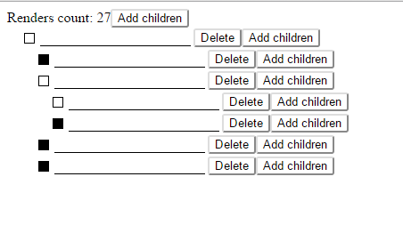

# Hiearchical Checklist.

Classic hierarchical checklist example, which you could often see in installers. 
This is checklist with a rule. Item is checked, if all children are checked. 

59 SLOC for jsx components, 28 for the model definition.

This example demonstrates unidirectional data flow with mutable state and pure render optimisation. And different features of the NestedReact state management.

- Declarative definition of mutable observable state. `static state = { element : ConstructorFunction }`.
- Two-way data binding with advanced value links. `const links = model.linkAll( 'checked', 'name' )`.
- Simplified React props spec. `static props = { name : ConstructorFunction, name2 : Constructor.value( defaultValue ) }`
- Declarative `pureRender` for mutable data and value links. `static pureRender = true`.
- Recursive state definitions. Model can mention itself in its attribute specs, thus, it's possible to define
    (potentially) infinite recursive data structures.
- Change watchers. It's possible to attach 'watchers' to any attribute, which would be called on value change.
- Transactional updates. Any change made to the model from the watcher is being added to the current transaction,
    resulting in the single 'change' event per transaction. Look at the render count in the example - you've got one
    render no matter how many checkboxes was flipped.

  
